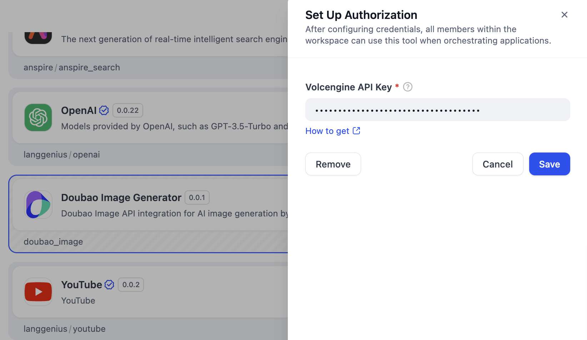
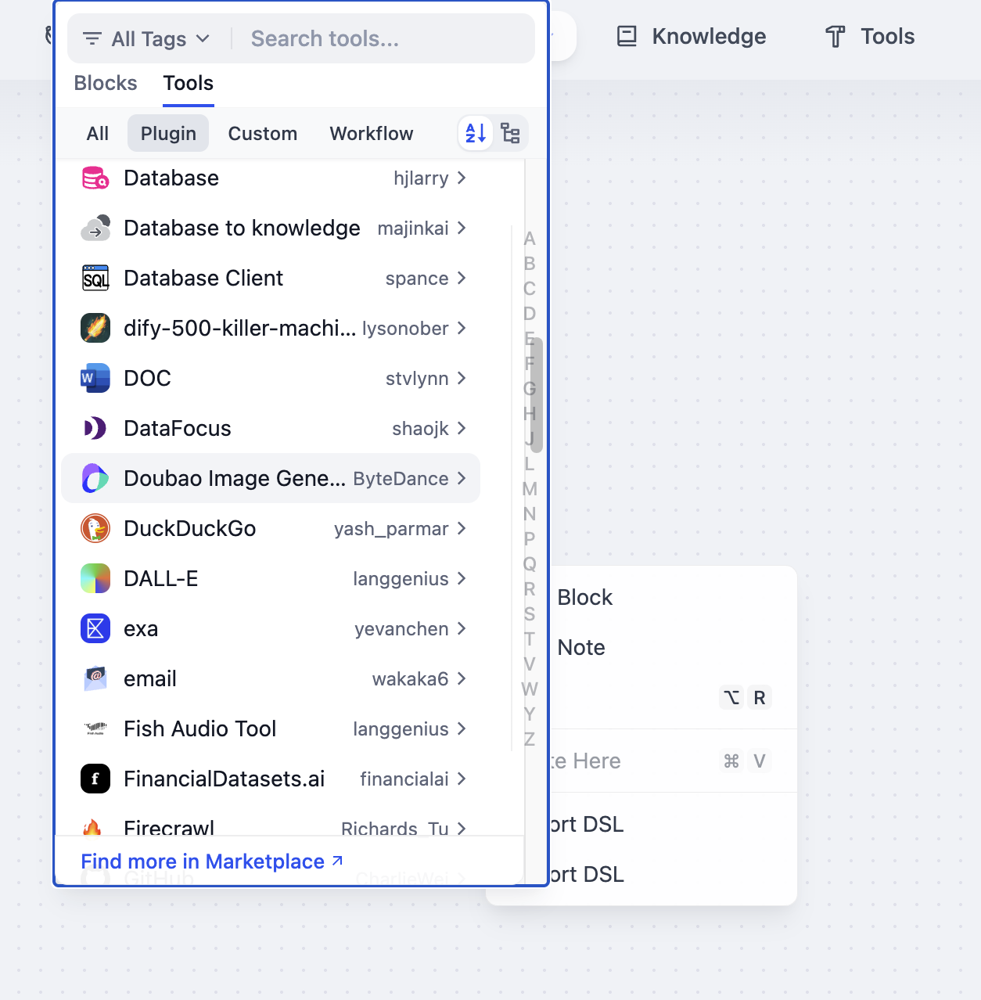

# Doubao画像・動画ジェネレーター 🎨📹

Volcengine/ByteDanceのDoubao APIを活用した包括的なAIメディア生成Difyプラグイン。テキストから画像・動画の生成、および画像から動画への変換機能を提供します。

## 🌟 機能特徴

本プラグインは3つの強力なAI生成ツールを提供します：

### 1. 📝 テキストから画像生成（Text to Image）
- **高品質画像生成**：テキスト記述から美しい画像を生成
- **複数アスペクト比**：正方形（1024×1024）、縦向き（1024×1792）、横向き（1792×1024）
- **先進AIモデル**：Doubao Seedream 3.0を搭載
- **カスタマイズ可能**：精密な制御のためのパラメータ調整

### 2. 🎬 テキストから動画生成（Text to Video）
- **動画クリエイション**：テキストプロンプトから動的な動画を生成
- **柔軟なアスペクト比**：16:9、9:16、4:3、1:1の選択肢
- **時間オプション**：5秒または10秒の動画
- **複数モデル**：Doubao Seedance 1.0 LiteとDoubao Seaweed
- **プロフェッショナル出力**：様々な用途に対応

### 3. 🖼️ 画像から動画生成（Image to Video）
- **静的から動的へ**：静止画をダイナミックな動画に変換
- **スマートアニメーション**：テキストプロンプトによる動画制御
- **適応的アスペクト比**：自動最適化サポート
- **シームレス統合**：既存画像との完璧な連携
- **時間設定可能**：最大10秒の動画生成

## 🚀 クイックスタート

### 前提条件
- Difyプラットフォームへのアクセス
- Visual Servicesが有効化されたVolcengineアカウント

### ステップ1：APIキーの取得
1. [Volcengineコンソール](https://console.volcengine.com/home)にアクセス
2. アカウント作成またはサインイン
3. Visual Servicesに移動し、必要なAPIを有効化
4. ダッシュボードからAPIキーを生成

### ステップ2：プラグインのインストール
1. Difyのプラグインマーケットプレイスを開く
2. 「Doubao Image and Video Generator」を検索
3. 「インストール」をクリックし、完了まで待機

### ステップ3：認証設定
1. Difyで`ツール > Doubao Generator > 認証`に移動
2. VolcengineのAPIキーを入力
3. 設定を保存



### ステップ4：制作開始
プラグインの準備が完了し、Difyアプリケーションで使用可能です！



## 📋 使用例

### チャットフローアプリケーションでの使用
```
ユーザー：「山の湖に沈む夕日の画像を作成してください」
アシスタント：[Text to Imageツールを使用して画像を生成]

ユーザー：「この画像を10秒の動画にして、穏やかな水の波紋を追加してください」
アシスタント：[Image to Videoツールを使用してアニメーション動画を作成]
```

### ワークフローアプリケーションでの使用
- **バッチコンテンツ作成**：複数の画像/動画を順次生成
- **コンテンツパイプライン**：テキスト→画像→動画の変換を組み合わせ
- **品質管理**：生成全体で一貫したパラメータを設定

### エージェントアプリケーションでの使用
- **インテリジェント判断**：エージェントが自動的に適切な生成ツールを選択
- **コンテキスト認識**：会話の流れに基づいて生成を調整
- **マルチモーダル応答**：テキスト、画像、動画をシームレスに組み合わせ

## ⚙️ 技術仕様

### サポートモデル
- **画像生成**：Doubao Seedream 3.0（`doubao-seedream-3-0-t2i-250415`）
- **動画生成**：
  - Doubao Seedance 1.0 Lite（`doubao-seedance-1-0-lite-t2v-250428`）
  - Doubao Seaweed（`doubao-seaweed-241128`）

### 出力フォーマット
- **画像**：高解像度PNG/JPEG
- **動画**：設定可能な時間のMP4フォーマット

### パフォーマンス
- **Text to Image**：約5-15秒の生成時間
- **Text to Video**：約30-90秒の生成時間
- **Image to Video**：約20-60秒の生成時間

## 🎯 ベストプラクティス

### プロンプトエンジニアリング
- **具体的に記述**：スタイル、照明、構図の詳細を含める
- **記述的形容詞を使用**：「鮮やかな色彩」「柔らかな照明」「映画的」
- **ムードを指定**：「平和な」「劇的な」「幻想的な」

### プロンプト例
```
Text to Image：「日の出時の雪に覆われた雄大な山頂、原始的な高山湖に反射する金色の光、フォトリアリスティックスタイル」

Text to Video：「夕日の砂浜に打ち寄せる穏やかな海の波、頭上を飛ぶカモメ、平和で静かな雰囲気」

Image to Video：「この風景に微妙な動きを追加 - 揺れる木々、流れる水、漂う雲」
```

### 最適化のヒント
- **適切なアスペクト比を選択**：用途に応じた最適な比率
- **短い時間から開始**：動画生成は5秒から試す
- **高品質なソース画像を使用**：Image to Video変換でより良い結果

## 🔧 トラブルシューティング

### 一般的な問題
- **APIキー無効**：VolcengineのAPIキーとサービス権限を確認
- **生成失敗**：プロンプトがコンテンツポリシーに準拠しているか確認
- **応答遅延**：ピーク時間は遅延の可能性、後で再試行
- **モデル未発見**：正しいモデル識別子を使用していることを確認

### エラーコード
- `401`：認証失敗 - APIキーを確認
- `429`：レート制限超過 - 待機後に再試行
- `500`：サーバーエラー - Volcengineサポートに連絡

## 📚 リソース

- [Volcengineドキュメント](https://www.volcengine.com/docs/85128/1526761)
- [Difyプラグイン開発ガイド](https://docs.dify.ai/plugins)
- [Doubao APIリファレンス](https://console.volcengine.com/docs)

## 🤝 貢献

貢献を歓迎します！以下のことができます：
- バグや問題の報告
- 新機能の提案
- プルリクエストの提出
- ドキュメントの改善

## 📄 ライセンス

このプロジェクトは、LICENSEファイルで指定された条件の下でライセンスされています。

---

**AIの力でアイデアを素晴らしいビジュアルに変換** ✨

*Mak J AI Limitedが❤️を込めて構築*